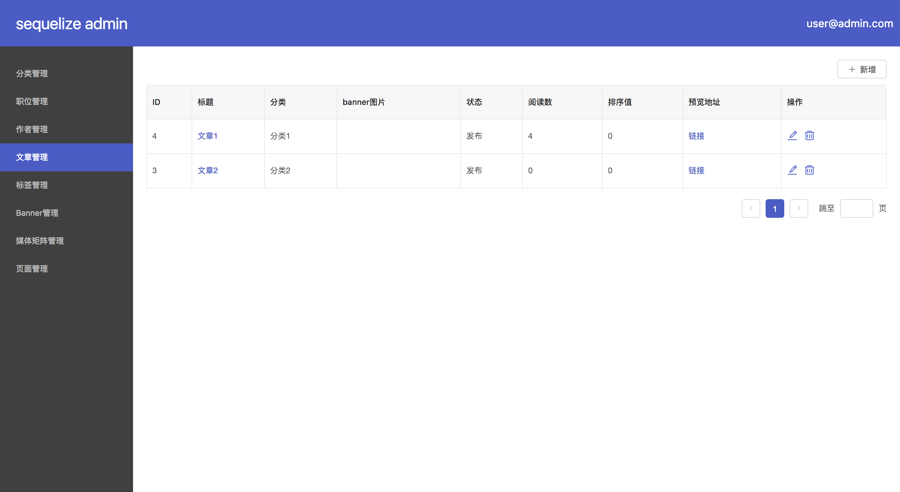

# koa-sequelize-admin

auto generate crud ui for sequelize with koa.js

## install

```
npm install koa-sequelize-admin --save
```

## how to use

add a admin file, and register model

```
const Admin = require('koa-sequelize-admin')
const admin = new Admin()

const UploadRecord = require('../model/uploadRecord')

admin.register(UploadRecord, {
  displayName: '上传记录',
  format: '{{ id }}',
  attributes: {
    id: 'ID',
    path: '路径'
  }
})
```

add router

```
router.get('/admin/', async(ctx, next) => {
  await ctx.render('admin', {})
})
router.use('/admin', admin.router.routes())
```

in admin template

```
<!DOCTYPE html>
<html>
<head>
  <meta charset="UTF-8">
  <meta name="viewport" content="width=device-width, initial-scale=1.0">
  <meta http-equiv="X-UA-Compatible" content="ie=edge">
  <title>sequelize admin</title>
  <link href="/dist/main.css rel="stylesheet">
  <script>
    var pageConfig = {
      isPopup: location.href.indexOf('popup=1') > -1,
      user: '{{ user | dump | safe }}'
    }
  </script>
</head>
<body>
  <div id="app"></div>
  <script src="/dist/vendor.js"></script>
  <script src="/dist/main.js"></script>
</body>
</html>
```

then you can get an admin ui



## ui code

[sequelize-admin-ui](https://github.com/zenxds/sequelize-admin-ui)
